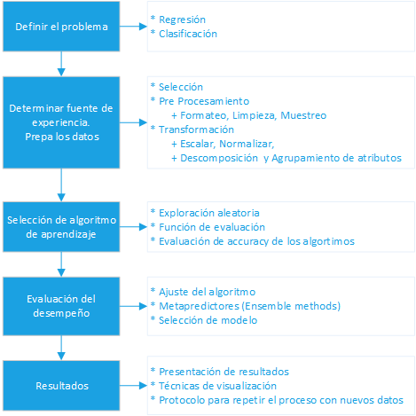

# Introducción al Aprendizaje de máquina o Machine Learning

## ¿Para qué hacer que una computadora aprenda?
  * Buscamos entender (relaciones, similitudes, diferencias, invariantes), buscamos predecir
  * Buscamos modelar un fenómeno sin tener el conocimiento explícito del proceso subyacente

El aprendizaje de máquina consiste de varias técnicas (familias de funciones) para aproximar el proceso que genera lo observado

## ¿Dónde y para qué se puede usar el aprendizaje automático? 
[Does Machine Learning Really Work? Tom Mitchell. AI Magazine 1997](http://www.aaai.org/ojs/index.php/aimagazine/article/view/1303/1204)
 * Tareas difíciles de programar (adquisición de conocimiento, reconocimiento de caras, voz, ...)
 * Aplicaciones auto adaptables (interfaces inteligentes, spam filters,sistemas recomendadores, ...)
 * Minería de datos/Descubrimiento de conocimiento (análisis de datos inteligente)

## ¿Qué es?
  1. **_*Tom Michell*_**
   - Se dice que un programa de computadora aprende de su experiencia *E* con respecto a una tarea *T* y función de evaluación *F*, si su desempeño en la tarea T (con respecto a la evaluación F) mejora con la experiencia E
   - Estudio de algoritmos que mejoran su rendimiento **P**  en alguna tarea **T**  con experiencia **E**  tarea de aprendizaje: **< P, T, E >**
  2. **_*Arthur Samuel*_** - El campo de estudio que da a las computadoras la capacidad de aprender sin ser programada de forma explícita
  
En general un problema de aprendizaje debe precisar:
  * La clase de tareas a las que se refiere **T**
  * La función de evaluación  **F**
  * La fuente de experiencia **E**
  * Ejemplo:
   - Encontrar la tendencia de una acción:
     + **Tarea** Predecir el precio futuro de una acción
     + **F.e** Ganancias
     + **Experiencia** Movimientos históricos de un año
   - Predecir si un día es bueno para jugar tenis
     + **Tarea** Clasificar días como buenos o malos para jugar tenis
     + **F.e** Porcentaje de días bien clasificados y porcentaje de días mal clasificados
     + **Experiencia** Historia de un mes

Ya definido esto podemos seleccionar un modelo (_*función objetivo*_) y ajustarlo para maximizar su desempeño 

## Tipos de problemas
Lo que queremos aprender es una función que dado un ejemplo (un dato) nos entregue un valor
  * Si el valor es numérico se conoce como regresión: El valor de una acción
  * Si el valor es categórico se conoce como clasificación: Si un día es bueno o no para jugar tenis

## Tipos de técnicas
Dependido de si tenemos disponible el valor de la función objetivo para los ejemplos de entrenamiento, las tareas de aprendizaje se dividen en:
  * **Aprendizaje Supervisado**: Se utilizan los datos de entrenamiento y el valor correcto para cada uno de ellos de la función objetivo (la función que intentamos aprender). Le damos al algoritmo un conjunto de datos con la respuesta correcta, lo que hacemos es predecir o generar nuevas respuestas.
    - Árboles de decisión, redes neuronales
  * **Aprendizaje No-supervisado**: Sólo se le presentan datos, se desconoce el valor objetivo de los ejemplos de entrenamiento
    - Técnicas de agrupamiento (“clustering”)
    - K-medias, EM, redes neuronales
    
## Minado de datos
#### Etapas
  * Limpieza
    - Remover datos ruidosos, inconsistentes, etc.
  * Integración
    - Combinar las diferentes fuentes de datos
  * Selección
    - Seleccionar el subconjunto de los datos relevante para el estudio. Si hay suficientes datos, guardar un subconjunto de estos para probar el modelo resultante
  * Transformación
    - Seleccionar atributos, generar atributos agregados, convertir tipos de variables, etc
  * Minado
    - Utilizar técnicas de clasificación y regresión (una tarea de minado involucra, por lo general, varias técnicas)
  * Evaluación
    - Identificar los resultados (patrones) interesantes (¿Qué es interesante?)
  * Presentación
    - Usar técnicas de visualización para presentar los resultados obtenidos.
    - Generar un sistema o protocolo para repetir el proceso con nuevos datos (de ser necesario)

#### Ejemplo, Caso Netflix
  * Descrición de los datos:
    - Los datos vienen en 1770 archivos de texto, uno por película
    - Cada archivo tiene en la primer línea el id de la película seguido de dos puntos “:”
    - El resto de la líneas tienen el siguiente formato: **_*Id_cliente, calificación, fecha*_**
    
##### **Etapa de PreProceso**
  * Limpieza
    - Los datos en el caso de Netflix están limpios. En otros ejercicios puede ser necesario remover ejemplos con errores, componer errores, llenar campos vacíos, homogeneizar valores (todo en mayúsculas,…), etc.
  * Integración
    - Son 1770 archivos, cómo los cargo todos? ¿Necesito todos?
    - Talvez generar un solo archivo que en cada línea tenga un cliente y, separado por comas, la calificación que da a una película
    - Buscar información adicional en IMDB y integrar
  * Selección
    - Sólo algunos clientes
    - Sólo algunas películas
    - Apartar un subconjuntos de datos para hacer pruebas
    - Remover fechas…
  * Transformación
    - Cambio de escala a calificaciones
    - Generación de variables derivadas

##### **Etapa de Minado**
  * Minado
    - Seleccionar técnicas de aprendizaje eg. C.5 y K-medias
    - Regresar, posiblemente, a la etapa de preproceso para alistar los datos
    - Minar, calcular errores, seleccionar otras técnicas,…

##### **Etapa de Post - Proceso**
  * Evaluación
  - Evaluar resultados. En este caso qué técnicas funcionaron, y que tan bien
  - En otros ejercicios de minado: que patrones interesantes se encontraron, por ejemplo
  * Presentación
    - Powerpoint + documento
    - Medidas de error para cada técnica
    - Tener el sistema listo para predecir
    - Netflix proporciona un archivo con clientes y películas para los cuales hay que generar una predicción. 

**_*Nota:*_** el proceso no es necesariamente lineal pues en ocasiones es necesario regresar a etapas anteriores

### Lo que hay que hacer, tu checklist

## Predicción Probabilística
### Modelos predictivos basados en probabilidades
Son efectibos en una gran cantidad de casos.
  * **Tipo de método:** Supervisado
  * **Supuestos:** Ejemplos de entrenamiento son representativos
  * Los datos provienen de un proceso que no es totalmente conocido Nosotros lo modelamos como un **proceso estocástico**
     + Por ejemplo: los datos son resultados de volados, los datos son precios de una acción
   * Gracias a que no tenemos toda la información necesaria para descubrir el proceso determinista que lo rige, definimos una variable aleatoria X que pude tomar distintos valores
    + Águila o Sol en el caso de los volados
    + Un número real positivo para las acciones  
  * Deseamos encontrar la probabilidad P(X=valor)
  * En el caso de los volados supongamos que P(X=aguila) =po
    + ¿Qué en P(X=sol)?

 * Estimar frecuencias
 * Calcular probabilidades
 * Usar regla de Bayes

### Ejercicios - Casos Contraintuitivos de la Probabilidad
 * **Película "Rosencrantz y Guildenstern han muerto"**
  - En la escena que abre la película, Rosencrantz va lanzando monedas al aire.
  - Si sale cara, la pierde y se la lleva Guildenstern; de lo contrario, se supone que recibe una moneda de Guildenstern.
  - Lleva lanzadas noventa y una. Todas han salido cara (y, por tanto, se las ha llevado Guildenstern).
  - A la próxima vez, la probabilidad de cruz es mayor, ¿no? **Pues, de hecho. . . ¡no!**
  - **_*¡Son eventos independientes!*_**
 
 * **La paradoja de Monty Hall (Catafixia de Chabelo)**
  - Se supone que todos los participantes en el juego conocen las reglas.
  - Detrás de una de las tres puertas está el coche; tú eliges una puerta.
  - Chabelo abre una puerta distinta de la elegida, y te muestra que el coche no está tras ella.
  - Y te pregunta: ¿seguro que no quieres cambiar?
  - ¿Es mejor cambiar? ¿es mejor mantener la elección? ¿da igual?
  - ¡Para que el problema esté bien planteado hemos de acordar qué significa "mejor"!

 * **La paradoja de Simpson**
  - Supongamos que las encuestas nos dicen:
   + En la provincia de C´aceres, los vegetarianos son menos propensos a tener ojeras que los no vegetarianos;
   + Y que en la provincia de Badajoz, los vegetarianos también son menos propensos a tener ojeras que los no vegetarianos.
   + Podemos deducir que esa correlaci´on se da en toda Extremadura,¿no?
   + **_*¡Error!*_** Es posible que, en la población conjunta, la ratio vaya a la inversa.
 
## Material adicional
 * [Video Humans Need Not Apply](https://www.youtube.com/watch?v=7Pq-S557XQU)
 * [Imitation Game de Alan Turing](https://github.com/hatshex/machine-learning/blob/master/art%C3%ADculos/01%20Imitation-game%20-%20translate.pdf)
 * [Funes el memorioso de José Luis Borges](https://github.com/hatshex/machine-learning/blob/master/art%C3%ADculos/01%20Funes%20el%20memorioso.pdf)
